# Python Cheat Sheet

Welcome to **Python Cheat Sheet**, your go-to online roadmap for concise and straightforward explanations of key Python
concepts. Whether you're a Python 3 learner or in need of a quick refresher on essential Python statements, this site is
tailored for you.

## Target Audience

Our content is designed for individuals aged 18 to 45 who are either studying Python or have a working knowledge of
Python 3, providing a handy reminder for those seeking rapid access to crucial Python information.

## Our Goal

Python Cheat Sheet's mission is to facilitate the swift retrieval of essential Python information. We strive to present
accurate content in a user-friendly and intuitive manner. Each topic includes links to the official Python 3
documentation for a more in-depth understanding.

## Key Features

- **Concise Information:** Get to the heart of Python concepts with simple and clear explanations.
- **User-Friendly Design:** Navigate through the site effortlessly with our intuitive layout.
- **Official Documentation Links:** Access detailed information directly from the official Python 3 documentation.
- **Feedback Form:** Share your thoughts and suggestions via our feedback form to help us improve your user experience.

Whether you're a Python enthusiast, student, or professional, **Python Cheat Sheet** is your go-to resource for quickly
grasping and reinforcing Python knowledge.

Link to the live site - [Python Cheat Sheet](https://dima-bulavenko.github.io/python-cheat-sheet/)

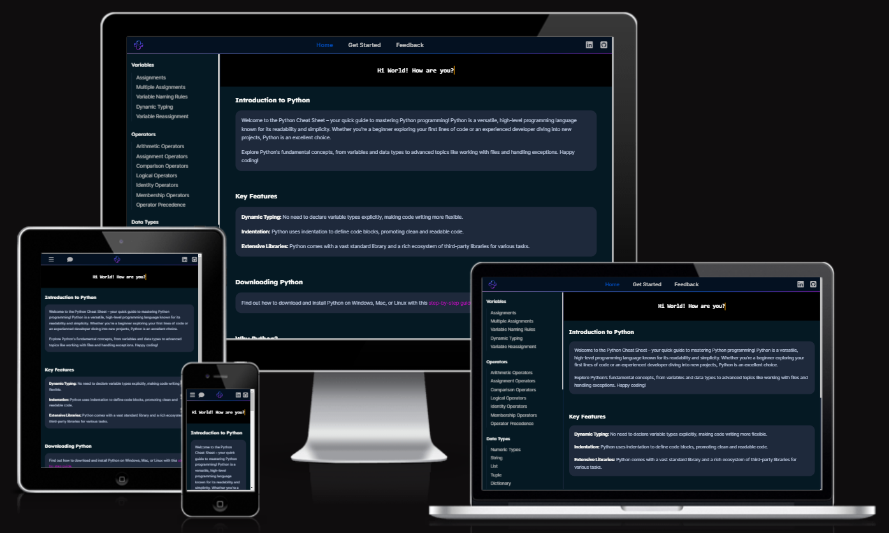

# Contents

* [**User Experience UX**](<#user-experience-ux>)
    * [User Stories](<#user-stories>)
    * [Wireframes](<#wireframes>)
    * [Site Structure](<#site-structure>)
    * [Design Choices](<#design-choices>)
    * [Typography](<#typography>)
    * [Colour Scheme](<#colour-scheme>)
* [**Features**](<#features>)
    * [**Home**](<#home>)
        * [Navigation menu](<#navigation-menu>)
        * [Main Header](<#main-header>)
        * [Introduction](<#introduction>)
        * [Mailing List](<#mailing-list>)
        * [Footer](<#footer>)
    * [**Restaurants**](<#restaurants>)
        * [Header](<#restaurant-header>)
        * [Restaurant Listings](<#restaurant-listings>)
        * [Footer](<#restaurant-footer>)
    * [**Snacks**](<#snacks>)
        * [Header](<#snacks-header>)
        * [Snack Listings](<#snack-listings>)
    * [**Drinks**](<#drinks>)
        * [Header](<#drinks-header>)
        * [Drink Listings](<#drink-listings>)
    * [**Contact**](<#contact>)
        * [Contact Background](<#contact-background>)
        * [Contact Form](<#contact-form>)
    * [**Form Submission Confirmation**](<#form-submission-confirmation>)
    * [**Future Features**](<#future-features>)
* [**Technologies Used**](<#technologies-used>)
* [**Testing**](<#testing>)
    * [**Validator Tests**](<#validator-tests>)
    * [**Responsiveness Tests**](<#responsiveness-tests>)
    * [**Lighthouse Tests**](<#lighthouse-tests>)
    * [**Browser Tests**](<#browser-tests>)
    * [**Bugs**](<#bugs>)
* [**Deployment**](<#deployment>)
    * [**Project Deployment Via GitHub**](<#project-deployment-via-github>)
* [**Credits**](<#credits>)
    * [**Content**](<#content>)
    * [**Media**](<#media>)
* [**Acknowledgements**](<#acknowledgements>)

# User Experience UX

## User Stories

* As a user I want to be able to fully understand the purpose of Python Cheat Sheet from the main landing page.
* As a user I want the navigation to be intuitive and easy to understand, with a clear purpose and easy access to
  information.
* As a user I want easy links that can lead me off page in a different tab to view the full menu and map locations of
  each item when applicable.
* As a user I want to be able to contact Python Cheat Sheet and share my own personal experience of using the site.
* As a user I want to be able to get more expansive information about key python concepts throughout python documentation.

[Back to top](<#contents>)

## Wireframes

The project templates and wireframes for Python Cheat Sheet were designed using [Balsamiq](https://balsamiq.com). The
designs vary from the end layout in some places due to creative decisions made throughout the development process.

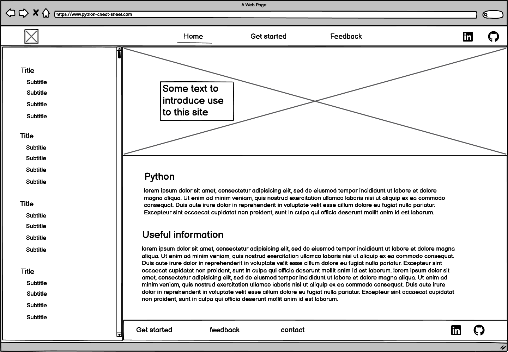

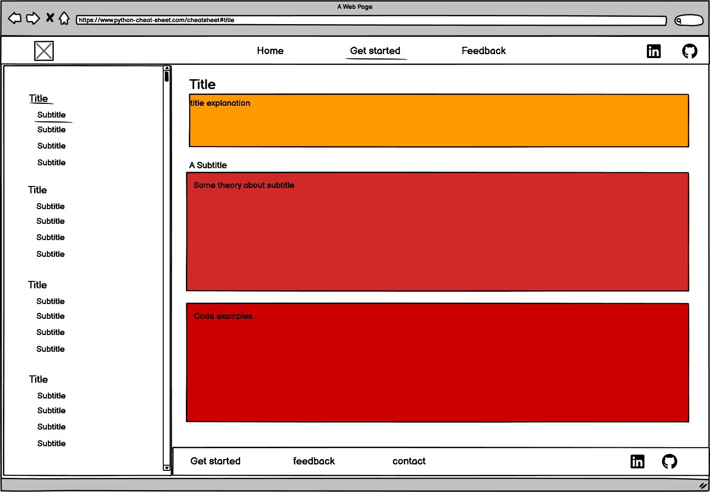

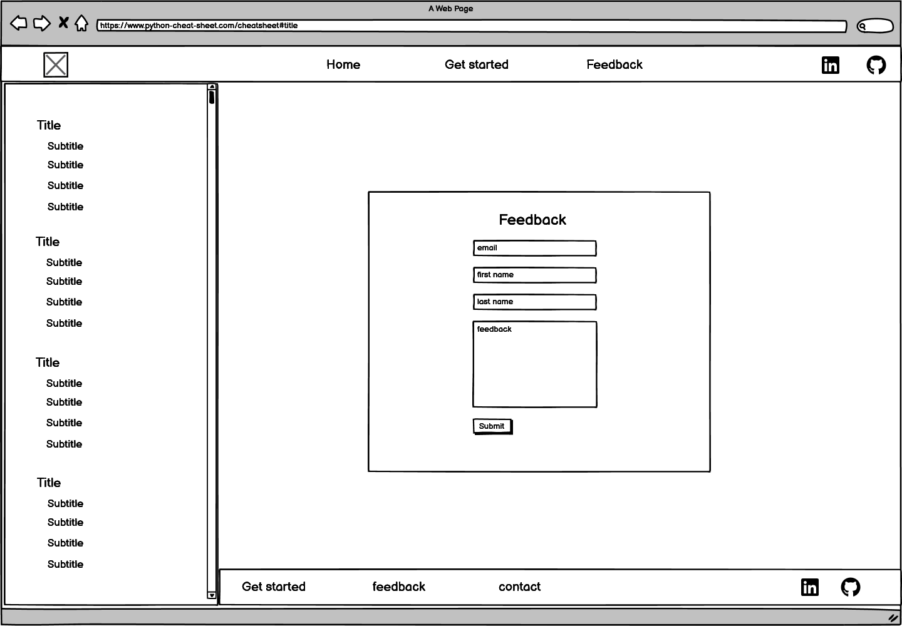

[Back to top](<#contents>)

## Site Structure

### Home Page
The home page serves as the central hub, outlining the site's primary objectives and purpose. Content includes an introduction to the Python language, reasons for learning it, and valuable links for tutorials and Python download.

### Get Started Page
The cheat sheet page, arguably the most crucial, offers users essential information on key Python concepts. Users can seamlessly navigate through topics using left side the topics navigation bar.

### Feedback Page
The feedback page provides visitors with the opportunity to express gratitude, share wishes, or provide valuable suggestions for site improvement.

## Common Elements Across Pages

### Header
- Contains the site's logo, linking back to the home page.
- Navigation bar facilitating easy movement throughout the site.
- Links to the developer's LinkedIn profile and the GitHub repository housing the site's source code.

### Footer
- Contains useful links to python documentation and online python compiler.

### Topics Navigation Bar
Enables users to swiftly move between topics, enhancing overall navigation efficiency.

[Back to top](<#contents>)

## Design Choices

* ### Typography

Python Cheat Sheet uses two font family. The first one is `Inter`, being used for all text on pages.
And the second one is `Lexend`, being used for headers elements of HTML. Both of the fonts are used with backup font of
`sans-serif`. The selection of these fonts is intentional, aiming to prioritize readability and deliver an optimal design for users.
The fonts were selected from [Google Fonts](https://fonts.google.com/).

* ### Colour Scheme

The final color scheme is a reflection of my preferences as a programmer, aiming for both aesthetic appeal and user-friendly design:

The background color, Rich Black, was chosen for its non-intrusive quality, providing a comfortable user experience without causing eye strain.

For text color, I opted for an off-white shade. This intentional choice creates a strong contrast with the background, enhancing the readability and clarity of information throughout the site.

Additionally, shades derived from Rich Black are strategically used for buttons and various blocks. This approach subtly highlights specific elements, contributing to a visually cohesive design. 

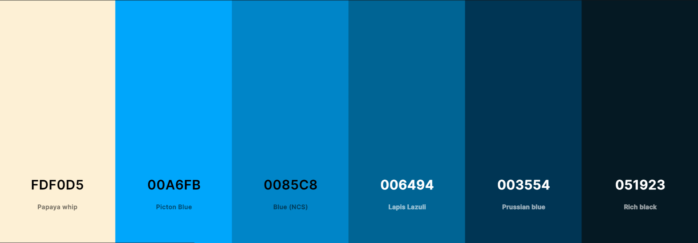

[Back to top](<#contents>)

# Features

Python Cheat Sheet is designed to make accessing key python concepts as easy for the user as possible. There are many user-friendly features which are formatted and styled in accordance with best practice. Users will be familiar with the
layout and flow of the site as it doesn't stray too far from the expected norm.

## Home

The home page is an introduction what Python is. It tells user the main features of this programing language, why you should learn this and give user link to guide "How to get python on your machine".

## Header
Header for laptop screens and higher include:

- Logo which lead user to the Home page.
- "Home" link lead user to the Home page as well.
- "Get started" lead user to the "Variables" topic.
- "Feedback" lead user to feedback page.
- LinkedIn logo lead user to LinkedIn account of site's developer.
- GitHub logo lead user to github repository of Python Cheat Sheet.

Header for smsmartphones and tabletsartphones and tablets include:

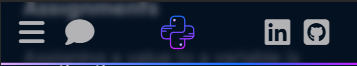

- Burger button open the topics navigation bar.
- Chat button lead user to feedback page.
- Logo which lead user to the Home page.
- LinkedIn logo lead user to LinkedIn account of site's developer.
- GitHub logo lead user to github repository of Python Cheat Sheet.

## Topic Navigation Bar
The Topic Navigation Bar consist of topics and their subtopics. This feature allows user quickly navigate through key python topics.
For phones and tablets screens this navbar is hidden and needs to be opened.

Topic Navigation Bar for phones and tablets:

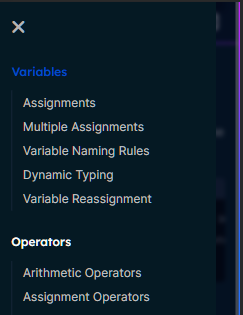

Topic Navigation Bar for laptops and PC:

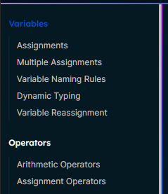

## Footer
The Footer contains links to python documentation and python online compiler. The footer allows users to get more information about python 

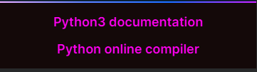

## Feedback form
The Feedback form allows users to leave their impression about the python cheat sheet and rate it.

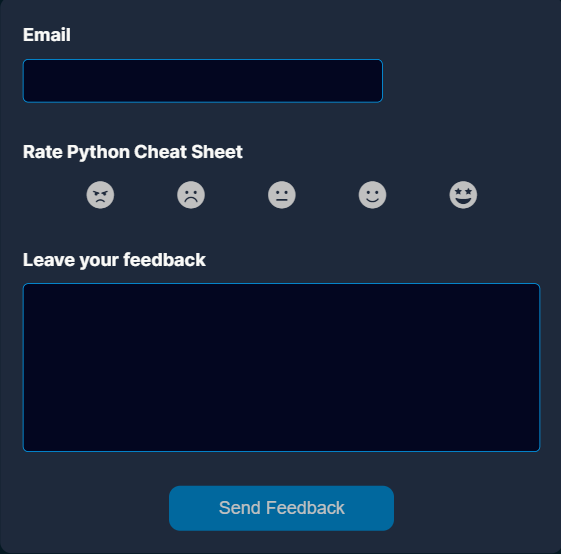

# Technologies Used

* [HTML5](https://developer.mozilla.org/en-US/docs/Glossary/HTML5) - Provides the structure of the site information,
  elements and website content.
* [CSS3](https://developer.mozilla.org/en-US/docs/Web/CSS) - Provides the styling of the HTML content.
* [Balsamiq](https://balsamiq.com/) - Wireframing software used to plan and design website templates.
* [GitHub](https://github.com/) - An online host for web and software development projects. Used to store the repository
  and deploy the finished website.
* [Git](https://git-scm.com/) - Software for tracking changes to files. Used with GitPod to add, commit and push code
  changes to the repository on GitHub.
* [Slack](https://www.icloud.com/notes) - An online messaging program designed for workplace collaboration. Used for
  advice and guidance from peers and tutors.
* [Highlight code](https://highlightjs.org/) was used to highlight and style python code.
* [ChatGPT](https://chat.openai.com/) was used to create readable and sensible text and to create similar pages using code structure template.

[Back to top](<#contents>)

# Testing

## Validator Tests

Disney Food Guide has been tested extensively. All the code for every page of the site has been run
through [The W3C HTML Markup Validation Service](https://validator.w3.org/) and
the [The W3C CSS Markup Validation Service](https://jigsaw.w3.org/css-validator/) to test the code for any errors. On
the final tests, no errors on any pages were found.

* ### Home page

* ### Restaurants

* ### Snacks

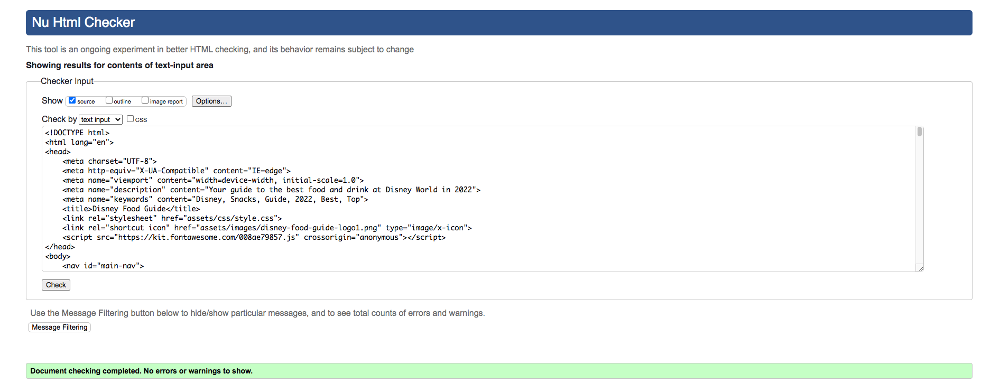

* ### Drinks

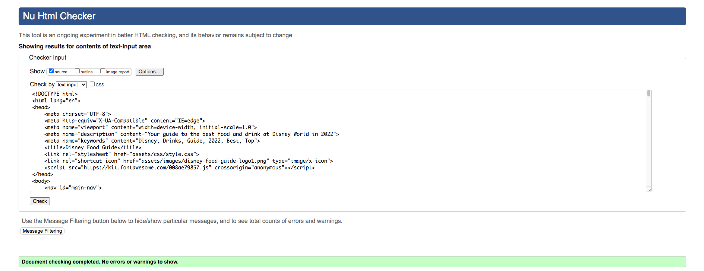

* ### Contact

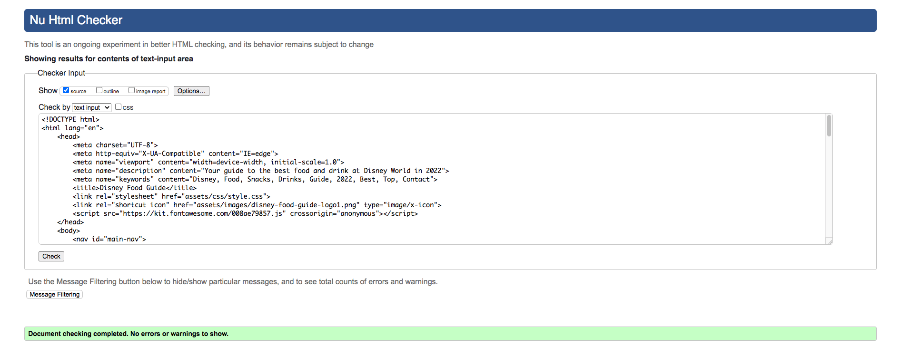

* ### Thanks

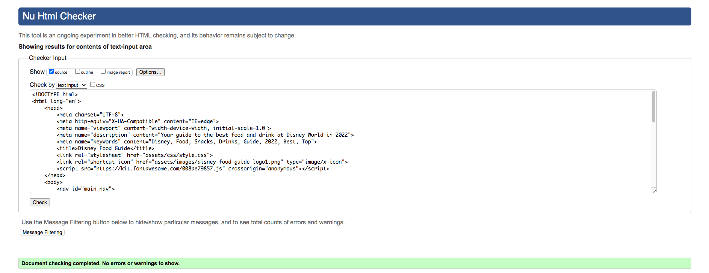

* ### Style.css

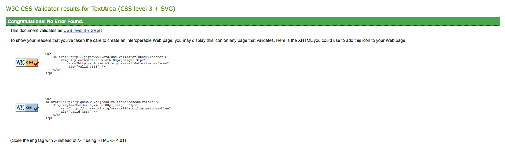

[Back to top](<#contents>)

## Responsiveness Tests

Disney Food Guide was tested thoroughly for responsiveness through multiple software applications and online resources.
Most of the testing was done manually through [Chrome Developer Tools](https://developer.chrome.com/docs/devtools/)
using the multiple preset device dimensions in the toolbar. Once the site layout was displaying well on every screen
size, further testing was done using [Am I Responsive](https://ui.dev/amiresponsive)
and [Responsive Design Checker](https://responsivedesignchecker.com/). Once the site was deployed on GitHub the link was
also used to view the pages on multiple physical devices such as an Apple iPad, Apple iPhone 6, Samsung Galaxy and Apple
MacBook Pro.

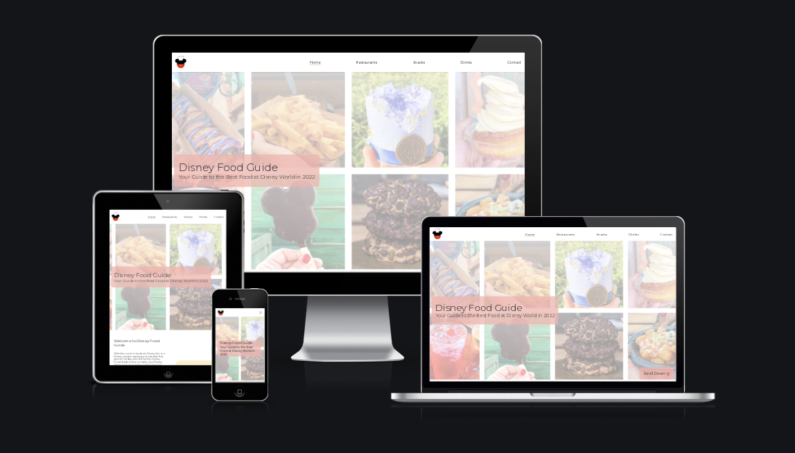

[Back to top](<#contents>)

## Lighthouse Tests

Disney Food Guide was also tested
through [Chrome Dev Tools - Lighthouse](https://developers.google.com/web/tools/lighthouse). It was tested on four main
areas - Performance, Accessibility, Best Practices and SEO.

* ### Home page

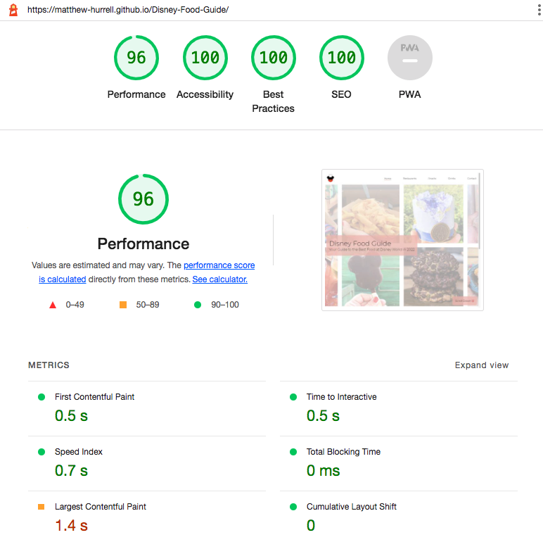

* ### Restaurants

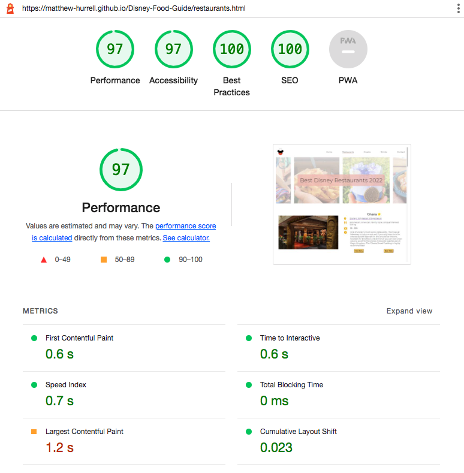

* ### Snacks

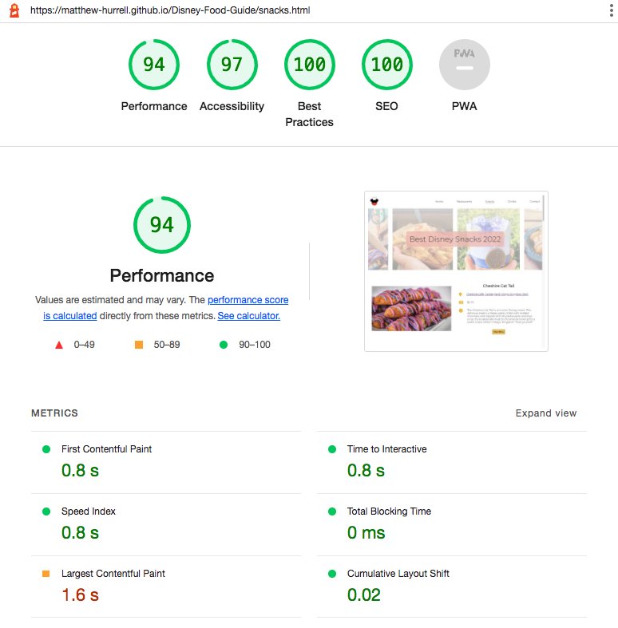

* ### Drinks

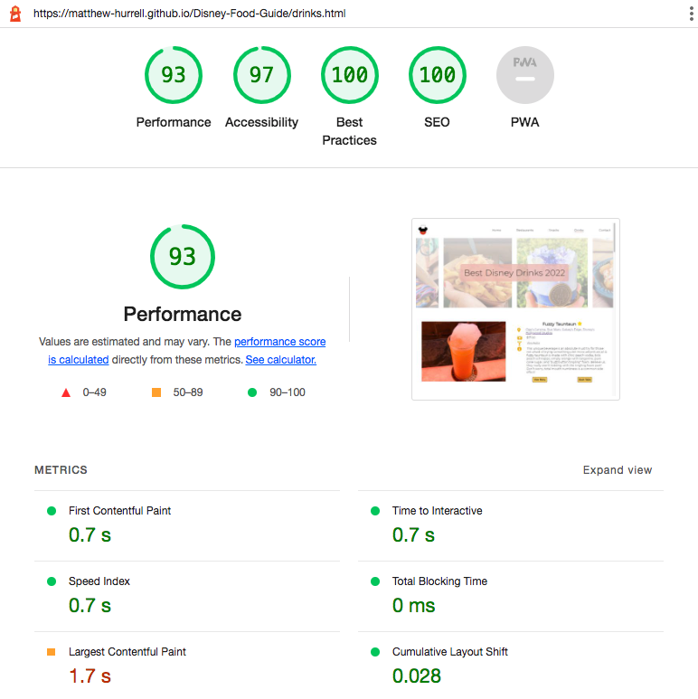

* ### Contact

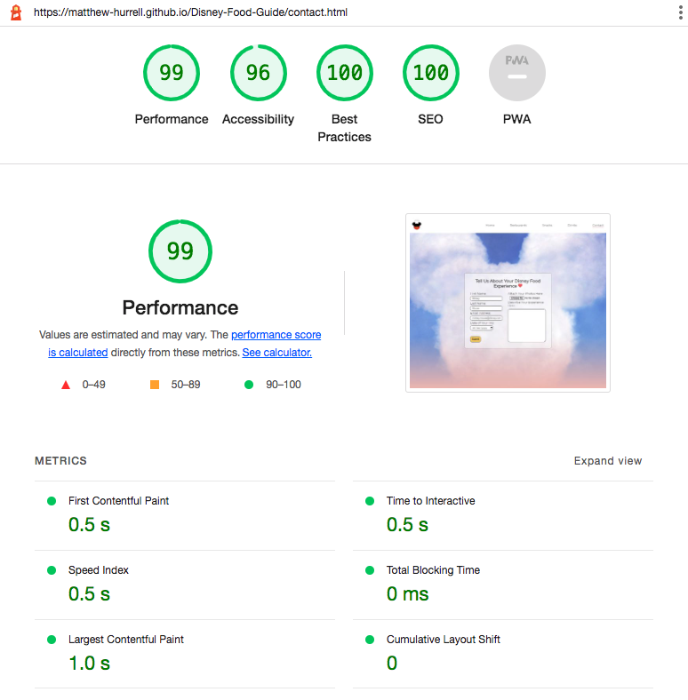

[Back to top](<#contents>)

## Browser Tests

Disney Food Guide was tested on a multitude of different browsers to check for any errors or issues. These browsers
included Google Chrome, Safari and Firefox. There were no visible errors in appearance or functionality. Responsivity
was also consistent.

[Back to top](<#contents>)

## Bugs

Bugs are an inevitable part of development. The project was built HTML and
CSS with no use of frameworks and this has its shortcomings. The lack of javascript limits functionality and
interactivity of the site.

* ### Resolved

* Incorrect link to my LinkedIn [Fixing Commit](https://github.com/Dima-Bulavenko/python-cheat-sheet/commit/8debbfe51d11a12ba6a04e3cc4ccac3082a46928).
* Scroll didn't appear when a content overflow a container ([Stuck overflow solution](https://stackoverflow.com/questions/16094785/have-a-fixed-position-div-that-needs-to-scroll-if-content-overflow))
* A bug was caused due to improperly placed `#nav-topics-hide` radio button which hide navigation topics bar. The button was nested inside the navigation bar that don't allow to close the bar. Extracting this element from the bar enabled to close it and make styling more simple ([Fixing commit](https://github.com/Dima-Bulavenko/python-cheat-sheet/commit/8bf8204d520ceb952de7f3ee690b4ebe02381790))
* The topics navigation bar cover the main and footer blocks because of its scrollbar and border width ([Fixing commit](https://github.com/Dima-Bulavenko/python-cheat-sheet/commit/ec193946286a00e54185b1a37cd400bd9f7a6fe9))
* Header element overlapped main element content when navigate to topics by anchor links ([Fixing commit](https://github.com/Dima-Bulavenko/python-cheat-sheet/commit/d396d5ab731a5add8f886ff18625f28e3cde0546)). 

* ### Unresolved

[Back to top](<#contents>)

# Deployment

## Project Deployment via GitHub

The Python Cheat Sheet repository is stored on GitHub. The site was created using GitPod and the live site is hosted on
GitHub Pages. This is a guide to deploy a site on GitHub Pages using GitHub.

1. Sign in to GitHub and go to the repositories menu by clicking on your avatar in the top right corner, then select
   the 'Your repositories' option .

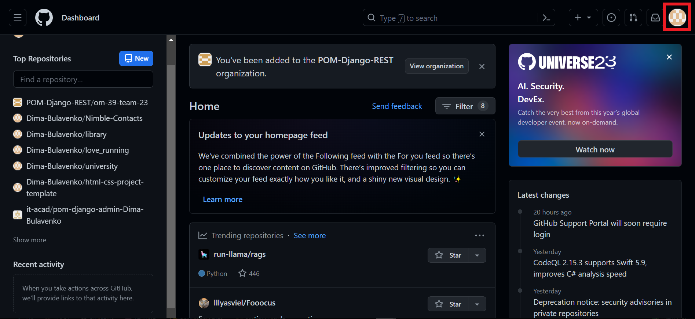

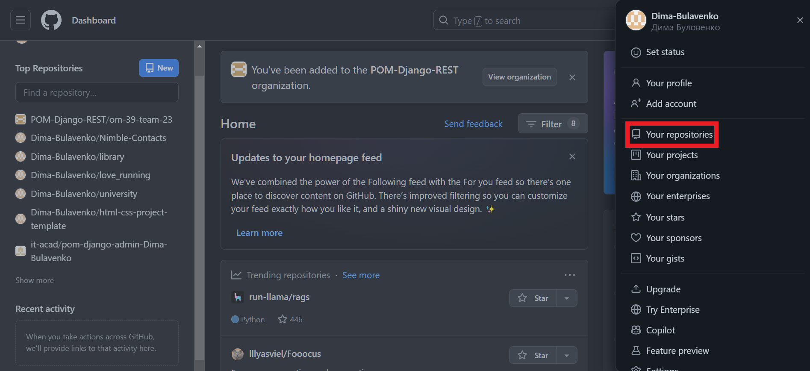

2. Click to open the repository and click on the settings icon to open the settings menu for the repository.

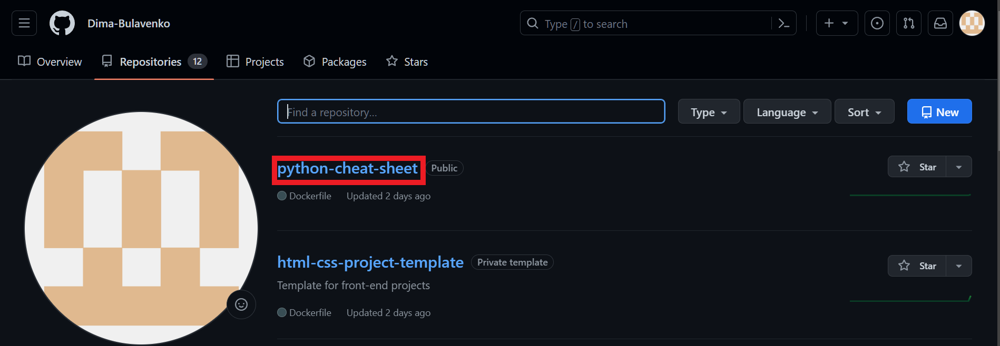

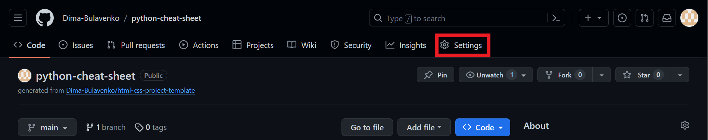

3. In the settings menu, click on the pages tab on the left side of the screen.

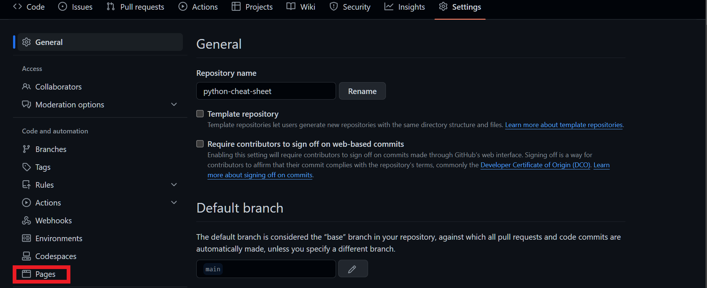

4. Under Branch, select branch:main, leave the folder on root and click save.

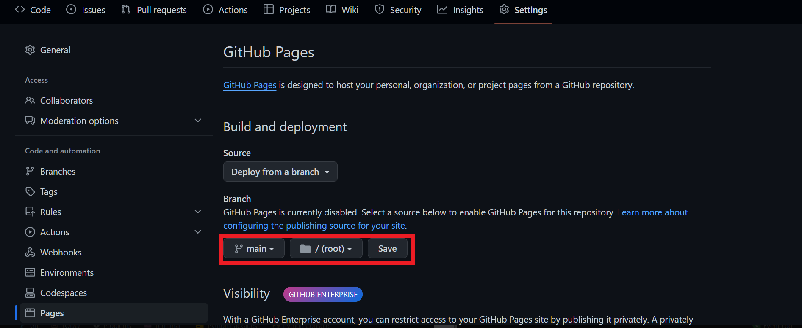

5. The page will then automatically refresh and provide a link to the published site when it has finished processing.

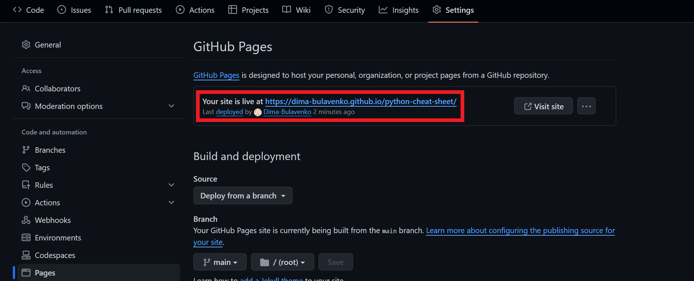

Congratulations! The site was deployed:)

The live link for Python Cheat Sheet can be found here - [Python Cheat Sheet](https://dima-bulavenko.github.io/python-cheat-sheet/)

[Back to top](<#contents>)

# Credits

This section will credit the sources of content and media for Python Cheat Sheet.

## Content

* For creating sensible and readable content was used [ChatGPT](https://chat.openai.com/)
* Fonts were imported from [Google Fonts](https://fonts.google.com/).
* Icons were imported from [Font Awesome](https://fontawesome.com/).
* The Python Cheat Sheet colour palette was inspired
  by [Dark Blue Colour Scheme.](https://coolors.co/fdf0d5-00a6fb-0085c8-006494-003554-051923)
* Information about using [CSS variables](https://www.w3schools.com/css/css3_variables.asp)
* Favicon and logo were created by using [icons8](https://icons8.com/icons)
* [Semantic HTML](https://www.semrush.com/blog/semantic-html5-guide/): What It Is and How to Use It Correctly
* How to create [Blurry Header](https://www.w3schools.com/cssref/css3_pr_backdrop-filter.php)
* [Gradient Creator](https://cssgradient.io/)
* How to create [Border with radius and gradient](https://dev.to/afif/border-with-gradient-and-radius-387f)
* How to create [Typewriter Effect](https://css-tricks.com/snippets/css/typewriter-effect/)
* Make math calculations in CSS using [calc()](https://www.w3schools.com/cssref/func_calc.php)
* Custom [scrollbar](https://www.w3schools.com/howto/howto_css_custom_scrollbar.asp)

## Media

* Images and graphics were used from [The Official Disney Website](https://www.disneyworld.co.uk/)
  and [Disney Food Blog](https://www.disneyfoodblog.com/).
* Map buttons link to maps found on [The Official Disney Website](https://www.disneyworld.co.uk/).
* Menu buttons link to menus found on [The Official Disney Website](https://www.disneyworld.co.uk/).
* Dining reservation buttons link to [Mouse Watcher](https://mousewatcher.com/).
* The contact page background image was found
  at [Wall Papers Den](https://wallpapersden.com/disney-the-imagineering-story-wallpaper/1336x768/).

[Back to top](<#contents>)

# Acknowledgements

Disney Food Guide was created as a portfolio 1 project for [Code Insitute](https://codeinstitute.net/), the first of
five projects of a Higher Diploma in Full Stack Software Development. I would like to take a moment to thank my
mentor [Precious Ijege](https://www.linkedin.com/in/precious-ijege-908a00168/) for all his help and encouragement
throughout the development process. I would also like to thank the Slack Community, especially Jim Morel the community
executive, for his advice about building a responsive nav using CSS when I was rather lost! I'd like to thank my peers
in the May 2022 class at Code Insitute for their feedback and support and also the tutors and student care team at Code
Institute. Thank you all for helping me on my journey to becoming a better developer.

Matthew Hobbs-Hurrell

